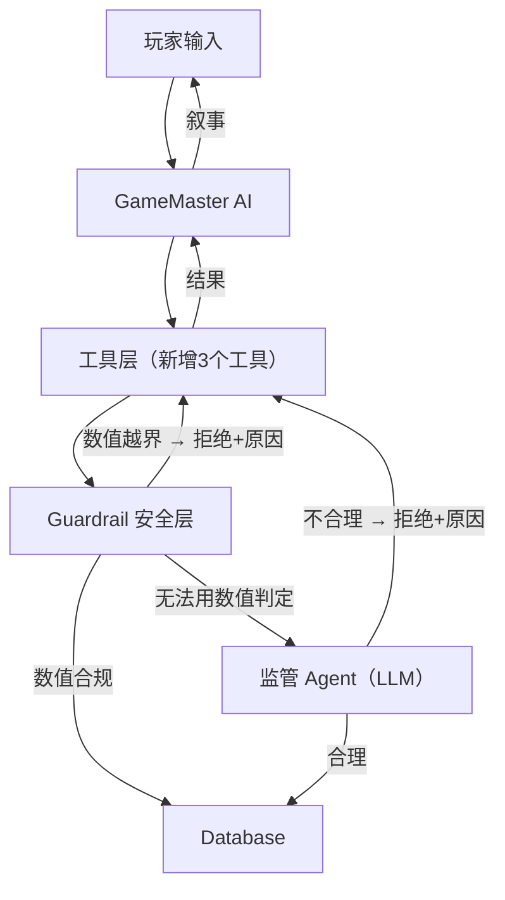
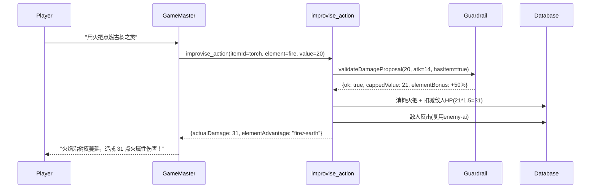
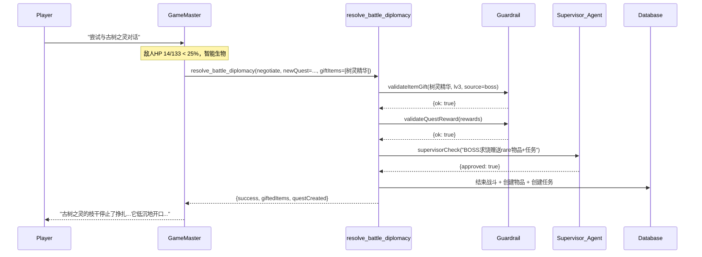

# 增加游戏开放性：创意行动 + 动态外交 + Guardrail 安全层

## 一、问题回顾

从对话历史中发现三类僵死场景：

1. **创意行动被拒**（[102-103]）：玩家想用火把烧古树，AI 打破第四面墙说"系统不支持"
2. **环境交互被拒**（[64-65, 68-69]）：玩家想捡翅翼/树枝，AI 编造"一碰就碎"来拒绝
3. **外交对话无效**（[104-107]）：玩家尝试与 BOSS 对话两轮，AI 只是把 defend 动作包装成"对话"，没有任何实质交互

根因：所有工具都是预设的固定动作（attack/skill/defend/item/flee），没有留给 AI 任何自主发挥空间。

## 二、架构设计：三层结构




核心原则：**给 AI 自由 → 但每个动作必须经过 Guardrail → 不合规就打回并附原因让 AI 重新生成**

## 三、Guardrail 安全层

新增文件：`src/lib/ai/guardrail.ts`

### 3.1 确定性数值校验（快速、零成本）

所有涉及数值的 AI 提议都先过这一层：

```
validateItemGift(item, playerLevel, source) → { ok, reason? }
validateDamageProposal(value, playerAttack, hasItem) → { ok, cappedValue, reason? }
validateQuestReward(rewards, playerLevel) → { ok, reason? }
```

**物品校验规则**：

- quality 上限由来源决定：pickup=uncommon, 敌人赠送=rare, BOSS 赠送=epic
- stats 数值上限 = `playerLevel * realmCoefficient * qualityMultiplier`（引用 [formulas.ts](src/lib/game/formulas.ts) 的 REALM_COEFFICIENTS）
- 禁止出现的 specialEffect 黑名单：instant_kill, infinite_gold, invincible 等
- 物品 type 必须在合法列表内

**伤害校验规则**：

- 有物品的创意攻击：上限 = `player.attack * 1.5`
- 无物品的环境攻击：上限 = `player.attack * 0.3`
- 元素克制加成：+50%（fire vs earth）；元素被克制惩罚：-50%

**任务校验规则**：

- 经验奖励上限 = `playerLevel * 30`
- 金币奖励上限 = `playerLevel * 50`
- 物品奖励递归走物品校验
- 同时活跃任务数上限 = 5

### 3.2 监管 Agent（LLM 判定，用于非数值问题）

当确定性规则无法判定时（如"这个剧情发展合理吗？"），调用一个轻量 LLM 做二次审核：

```typescript
async function supervisorCheck(context: {
  action: string,          // "enemy_offers_quest"
  description: string,     // "古树之灵求饶，提出守护祭坛的任务"
  playerState: string,     // 简要玩家状态
  battleState?: string,    // 简要战况
}): Promise<{ approved: boolean, reason?: string }>
```

- 使用快速/便宜模型（如 gpt-4o-mini）
- System prompt 极短：只判定"这个动作是否合理"，返回 yes/no + 原因
- 有超时兜底（2s 超时 → 默认通过，避免阻塞游戏体验）
- 可配置开关：`GUARDRAIL_SUPERVISOR_ENABLED=true/false`

**触发条件**（不是每次都调用）：

- 敌人主动赠送 rare+ 物品
- AI 提出的任务奖励包含技能
- 创意行动涉及非常规效果（如"永久debuff"）

## 四、新增工具 1：`improvise_action`（战斗创意行动）

添加到 [src/lib/ai/tools/action-tools.ts](src/lib/ai/tools/action-tools.ts)，注册到 BATTLE_TOOLS。

```
improvise_action({
  battleId?: string,
  itemId?: string,            // 可选，消耗背包物品
  description: string,        // "用火把点燃古树"
  targetIndex?: number,
  proposedEffect: {
    type: "damage" | "heal" | "debuff" | "utility",
    element?: string,         // "fire"
    value?: number,           // AI 提议数值
    duration?: number         // debuff 回合数
  }
})
```

执行流程：

1. 如果有 itemId → 校验物品存在且玩家拥有
2. 调用 `guardrail.validateDamageProposal()` 校验并 cap 数值
3. 计算元素克制（参考 [damage-calc.ts](src/lib/game/damage-calc.ts) 的元素关系）
4. 直接操作 DB：扣减敌人 HP、消耗物品、更新 battleState
5. 敌人仍会反击（复用现有 enemy-ai 逻辑）
6. 返回实际效果给 AI 撰写叙事

## 五、新增工具 2：`resolve_battle_diplomacy`（战斗外交）

添加到 [src/lib/ai/tools/action-tools.ts](src/lib/ai/tools/action-tools.ts)，注册到 BATTLE_TOOLS。

这是最关键的开放性工具，赋予 AI 在战斗中创造非战斗结局的能力。

```
resolve_battle_diplomacy({
  battleId?: string,
  resolution: "enemy_surrenders" | "enemy_flees" | "negotiate" | "player_tames",
  outcome: {
    // 敌人赠送物品（求饶时送的东西）
    giftItems?: Array<{ name, type, quality?, stats?, specialEffect? }>,
    // 敌人给予金币
    giftGold?: number,
    // 触发新任务
    newQuest?: {
      name: string,
      description: string,
      type: "main" | "side" | "hidden",
      objectives: Array<{ description, type, target?, required? }>,
      rewards: { exp?, gold?, items? }
    },
    // 敌人提供信息/线索
    information?: string,
    // 经验奖励（外交解决也应有收获，但通常低于战斗击杀）
    expReward?: number
  }
})
```

执行流程：

1. 校验战斗存在且 active
2. 所有 giftItems 过 `guardrail.validateItemGift()`
3. 如果有 newQuest，rewards 过 `guardrail.validateQuestReward()`
4. 如果有 rare+ 物品或技能奖励 → 触发 `supervisorCheck()`
5. 全部通过后：结束战斗、添加物品/金币/任务到 DB
6. 返回结果给 AI

**触发条件建议**（写入 System Prompt）：

- 敌人 HP < 25% 且具备智能（有 skills 或 name 含"灵"/"精"/"人"等）
- 玩家主动表达和平意图（"对话"、"谈判"、"别杀"）
- BOSS 节点敌人可以有更丰富的外交选项

## 六、新增工具 3：`interact_environment`（探索环境交互）

添加到新文件 `src/lib/ai/tools/environment-tools.ts`，注册到 EXPLORATION_TOOLS。

```
interact_environment({
  action: "pickup" | "use" | "examine" | "destroy",
  description: string,
  // pickup 时
  itemToAdd?: { name, type, quality?, quantity?, stats?, specialEffect? },
  // use 时消耗背包物品
  itemToConsume?: string,
  // 效果描述（纯叙事辅助）
  effectDescription?: string
})
```

执行流程：

- `pickup`：物品过 `guardrail.validateItemGift()` → 通过则 `prisma.inventoryItem.create`
- `use`：校验物品存在 → 消耗 → 返回成功（效果由叙事体现）
- `examine`/`destroy`：纯叙事，不改 DB，直接返回 success

## 七、System Prompt 更新

在 [src/lib/ai/system-prompt.ts](src/lib/ai/system-prompt.ts) 中修改三处：

### CORE_PROMPT 追加

```
【第四面墙禁令】
- 严禁使用"系统"、"消耗品"、"工具"、"数据库"等元游戏词汇
- 如果某个行动在世界观中不合理，用世界观逻辑解释
  ✅ "古树表皮湿润，火焰难以附着，只造成了轻微灼伤"（Guardrail 削减了伤害）
  ❌ "火把不是消耗品，系统无法使用"

【AI 自主权限】
- 你拥有通过工具创造动态内容的权限：赠送合理物品、创建临时任务、让敌人投降
- 所有提议都会经过安全系统校验，被打回时根据拒绝原因调整提议
- 你的自由边界：可以大胆提议，系统会替你把关数值合理性
```

### BATTLE_PROMPT 追加

```
【创意行动】
- 玩家提出非标准战斗行为时（"用火把烧它"、"把石头推向它"），调用 improvise_action
- 根据物品属性和敌人特征估算 proposedEffect
- 如果没有合适物品，也可以用环境元素（但伤害会很低）

【战斗外交】
- 当敌人 HP < 25% 且为智能生物时，可以在 suggestions 中提供"谈判"选项
- 玩家主动表达和平意图时，调用 resolve_battle_diplomacy
- 敌人可以：求饶并赠送物品、提供线索、触发隐藏任务、被驯服
- BOSS 可以有更复杂的外交剧情（如揭示身世、提出交易）
- 不要连续防御两轮来模拟对话！必须调用外交工具产生实际结果
```

### EXPLORATION_PROMPT 追加

```
【环境交互】
- 玩家想捡起/使用/破坏环境物品时，调用 interact_environment
- 不要编造"物品碎了/消失了"来拒绝合理的拾取请求
- 可拾取物品的品质上限为 uncommon，AI 应按场景合理生成
- 战斗后的怪物尸体、场景中的素材都是可交互对象
```

## 八、文件变更清单


| 文件                                      | 变更内容                                                     |
| --------------------------------------- | -------------------------------------------------------- |
| `src/lib/ai/guardrail.ts`               | **新增**：确定性校验函数 + 监管 Agent 调用                             |
| `src/lib/ai/tools/action-tools.ts`      | 新增 `improvise_action` + `resolve_battle_diplomacy` 定义和执行 |
| `src/lib/ai/tools/environment-tools.ts` | **新增**：`interact_environment` 定义和执行                      |
| `src/lib/ai/tools/index.ts`             | 注册 3 个新工具到对应工具集 + TOOL_HANDLERS                          |
| `src/lib/ai/system-prompt.ts`           | 追加创意行动/战斗外交/环境交互/第四面墙禁令                                  |
| `src/lib/ai/hallucination-detector.ts`  | 调整：不再将 diplomacy 结果误判为幻觉                                 |


## 九、完整数据流示例

### 场景 A：用火把烧古树




### 场景 B：BOSS 求饶触发任务




