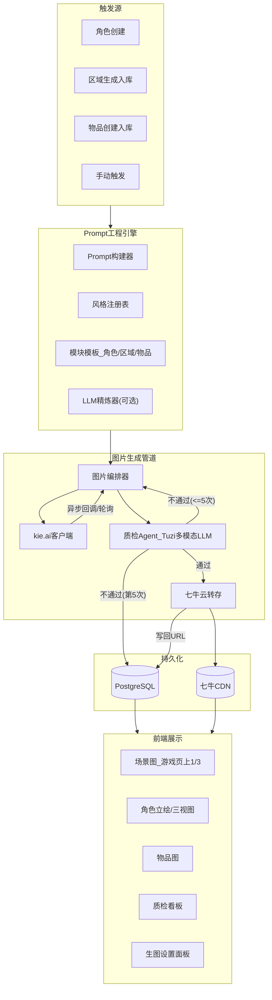
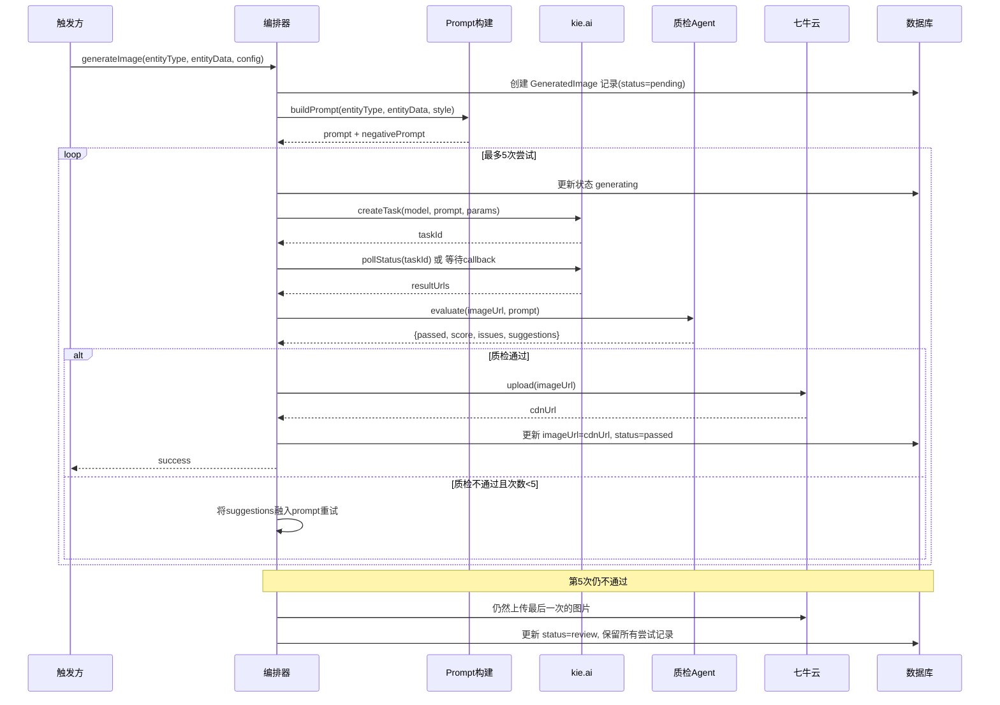

# ChaosSaga AI 视觉生成展示层 — 优化最终方案

## 一、整体架构




---

## 二、kie.ai 客户端设计

### 2.1 API 接口封装

kie.ai 采用统一的异步任务模式，两个模型共享同一个 endpoint，仅 `model` 和 `input` 参数不同。

**统一调用接口**：`POST https://api.kie.ai/api/v1/jobs/createTask`

**Nano Banana** (`google/nano-banana`)：

- 参数：`prompt`, `output_format`(png/jpg), `image_size`(宽高比如 "1:1")
- 成本较低，适合批量场景图、物品图

**Nano Banana Pro** (`nano-banana-pro`)：

- 参数：`prompt`, `image_input`(参考图数组), `aspect_ratio`, `resolution`(1K/2K/4K), `output_format`
- 支持参考图输入（用于三视图一致性）
- 成本较高，适合角色主视图、高品质物品

**任务状态查询**：`GET https://api.kie.ai/api/v1/jobs/recordInfo?taskId=xxx`

- 状态流：`waiting` → `queuing` → `generating` → `success`/`fail`
- 成功后从 `resultJson.resultUrls` 获取临时图片 URL（14天过期，必须转存）

**客户端文件**：`src/lib/image/kie-client.ts`

```typescript
// 核心接口
interface KieCreateTaskRequest {
  model: 'google/nano-banana' | 'nano-banana-pro';
  callBackUrl?: string;
  input: {
    prompt: string;
    image_input?: string[];      // 仅 Pro
    aspect_ratio?: string;       // Pro: "1:1" | "16:9" | "9:16" 等
    image_size?: string;         // Banana: "1:1" 等
    resolution?: '1K' | '2K' | '4K';  // 仅 Pro
    output_format?: 'png' | 'jpg';
  };
}

interface KieTaskResult {
  taskId: string;
  state: 'waiting' | 'queuing' | 'generating' | 'success' | 'fail';
  resultUrls?: string[];  // 从 resultJson 解析
  failMsg?: string;
}
```

**轮询策略**（遵循 kie.ai 官方建议）：

- 前 30s：每 3s 轮询一次
- 30s-2min：每 8s 一次
- 2min+：每 20s 一次
- 超过 10min：标记超时失败

**回调模式**（生产推荐）：

- 新增 API Route `POST /api/image/callback` 接收 kie.ai 回调
- 回调触发后续质检 + 转存流程

### 2.2 模型选择策略

各模块默认模型映射（可在设置中覆盖）：

- **角色主视图/三视图**：`nano-banana-pro`（高质量，支持参考图）
- **区域场景图**：`google/nano-banana`（批量生成，成本控制）
- **区域封面图**：`nano-banana-pro`（门面图高质量）
- **物品图(epic)**：`google/nano-banana`
- **物品图(legendary)**：`nano-banana-pro`

---

## 三、七牛云对象存储服务

### 3.1 转存服务设计

**文件**：`src/lib/image/qiniu-storage.ts`

**核心流程**：

1. 从 kie.ai `resultUrls` 下载图片到内存 Buffer
2. 使用七牛 Node.js SDK 上传到指定 Bucket
3. 返回永久 CDN URL（`https://<domain>/<key>`）

**存储路径规则**：

```
chaossaga/
  characters/{playerId}/{timestamp}-main.png      # 角色主视图
  characters/{playerId}/{timestamp}-front.png     # 正面
  characters/{playerId}/{timestamp}-side.png      # 侧面
  characters/{playerId}/{timestamp}-back.png      # 背面
  characters/{playerId}/{timestamp}-thumb.png     # 头像
  areas/{areaId}/{nodeId}-{timestamp}.png         # 区域节点场景
  areas/{areaId}/cover-{timestamp}.png            # 区域封面
  items/{itemId}-{timestamp}.png                  # 物品图
```

**配置项**（存 GameConfig 或 .env）：

- `QINIU_ACCESS_KEY`
- `QINIU_SECRET_KEY`
- `QINIU_BUCKET`
- `QINIU_DOMAIN`（CDN 域名）

**依赖**：`qiniu`（npm 包）

### 3.2 缩略图生成

七牛云支持 URL 后缀做图片处理，不需要额外生成缩略图文件：

- 原图：`https://cdn.example.com/characters/xxx/main.png`
- 缩略图：`https://cdn.example.com/characters/xxx/main.png?imageView2/1/w/128/h/128`

---

## 四、Prompt 工程引擎

### 4.1 风格注册表

**文件**：`src/lib/image/style-registry.ts`

内置预设风格（可通过设置扩展）：

- **东方水墨奇幻**：水墨画风格 + 奇幻元素
- **日系动漫**：anime style, cel shading
- **欧美奇幻插画**：digital painting, fantasy art
- **写实奇幻**：photorealistic, cinematic lighting
- **像素风**：pixel art, retro game style
- **水彩梦幻**：watercolor, soft, dreamy

每个风格包含：

- `positivePrefix`：风格正向关键词前缀
- `positiveSuffix`：质量关键词后缀
- `negativePrompt`：通用负向提示词
- `recommendedModel`：推荐使用的 kie.ai 模型
- `recommendedParams`：推荐参数（宽高比、分辨率）

### 4.2 模块 Prompt 模板

**文件**：`src/lib/image/prompt-templates.ts`

**角色模板**：

```
[style_prefix], full body character portrait,
{name}, {race} character, {realm} realm warrior,
{appearance_description},
wearing {equipment_description},
{element} elemental aura,
{pose} pose,
[style_suffix]
```

**角色三视图模板**：

```
[style_prefix], character reference sheet, three views,
{name}, {race}, {appearance_description},
front view | side view | back view,
consistent design, white background,
[style_suffix]
```

**区域场景模板**：

```
[style_prefix], wide landscape scene,
{area_name}, {theme} themed environment,
{environment_description},
{mood} atmosphere, {time_of_day}, {weather},
[style_suffix]
```

**物品模板**：

```
[style_prefix], single item centered on dark background,
{item_name}, {type}, {quality} quality,
made of {material},
{special_effect_description},
{element} elemental glow,
[style_suffix]
```

### 4.3 LLM Prompt 精炼器（可选）

**文件**：`src/lib/image/prompt-refiner.ts`

- 复用 `LLMClient`，调用一个轻量模型（如 gpt-4o-mini）
- System Prompt：你是图片生成Prompt专家，请优化以下prompt使其更适合AI图片生成...
- 输入：模板生成的初步 prompt + 实体数据上下文
- 输出：精炼后的 prompt
- 可在设置中开关（默认关闭以节省 token）

---

## 五、图片编排器

**文件**：`src/lib/image/orchestrator.ts`

这是整个视觉生成的核心调度中心，串联所有环节。




**关键设计**：

- 每次生成尝试都记录到 `GeneratedImage` 表（同一 entityId 可有多条记录）
- 质检不通过时，`suggestions` 被拼接到下一次 prompt 的末尾（如 "avoid extra fingers, ensure clear facial features"）
- 第5次不通过时，图片仍然转存到七牛（待人工从5张中选择最佳的）
- 支持异步执行，不阻塞主流程

---

## 六、质检 Agent

### 6.1 独立配置

质检 Agent 使用现有 Tuzi API LLM 供应商，但**独立配置供应商和模型**：

**配置存储**（GameConfig 表）：

- `qc_provider_id`：供应商ID（如 "tuzi"）
- `qc_model`：具体模型（如 "gpt-4o" 或 "claude-opus-4.5"，必须支持多模态/视觉）
- `qc_temperature`：温度（建议 0.3，偏严格）
- `qc_threshold`：通过分数阈值（默认 60）
- `qc_max_retries`：最大重试次数（默认 5）
- `qc_enabled`：是否启用质检（关闭则直接通过）

### 6.2 质检实现

**文件**：`src/lib/image/qc-agent.ts`

**System Prompt**：

```
你是一个AI生成图片的质量检测专家。你会收到一张AI生成的图片和生成它所用的Prompt。
请从以下维度评估图片质量：

1. 一致性(0-25分)：图片内容是否与Prompt描述一致
2. 质量(0-25分)：是否有明显缺陷（变形、模糊、伪影、多余肢体等）
3. 完整性(0-25分)：关键元素是否完整呈现
4. 美观度(0-25分)：整体构图、色彩、光影是否协调

请以JSON格式返回：
{
  "score": 总分(0-100),
  "passed": 是否通过(总分>=阈值),
  "dimensions": { "consistency": N, "quality": N, "completeness": N, "aesthetics": N },
  "issues": ["问题1", "问题2"],
  "suggestions": ["改进建议1", "改进建议2"]
}
```

**调用方式**：

- 使用 `LLMClient.chat()` 的多模态能力
- messages 中包含图片 URL（或 base64）+ 原始 Prompt 文本
- 解析 JSON 响应，提取评分和建议

### 6.3 质检结果存储

每次质检结果存入 `GeneratedImage` 表的 `qcResult` JSON 字段：

```json
{
  "score": 72,
  "passed": true,
  "dimensions": { "consistency": 20, "quality": 18, "completeness": 17, "aesthetics": 17 },
  "issues": [],
  "suggestions": [],
  "model": "gpt-4o",
  "evaluatedAt": "2026-02-11T..."
}
```

---

## 七、质检看板

### 7.1 页面设计

在底部导航新增入口或在设置 Tab 中作为子页面。

**看板包含两个主要视图**：

**Tab 1：全部已通过**

- 按实体类型分组（角色/区域/物品）或按时间线排列
- 每项展示：缩略图、实体名称、质检分数、生成时间、使用的模型
- 点击可查看大图 + 完整 Prompt + 质检详情
- 支持筛选：按类型、按分数范围、按时间

**Tab 2：待人工审核**

- 展示所有 status=review 的图片
- 每项展示 5 次生成历史（横向滑动查看）
- 每张图显示：图片、质检分数、问题列表
- 操作按钮：
  - 「使用此图」— 将选中的图标记为 passed，更新到实体
  - 「全部不合格，重新生成」— 重置计数，再走一轮生成管道
  - 「跳过」— 标记为 skipped，实体暂不展示图片

**统计概览**（看板顶部）：

- 总生成数 / 一次通过率 / 平均质检分数 / 待审核数量

### 7.2 API 路由

- `GET /api/image/list` — 分页查询图片列表（支持 status/entityType/entityId 筛选）
- `POST /api/image/review` — 人工审核操作（approve/reject/skip）
- `POST /api/image/regenerate` — 手动触发重新生成
- `GET /api/image/stats` — 统计数据

---

## 八、数据库 Schema 变更

### 8.1 新增 GeneratedImage 表

```prisma
model GeneratedImage {
  id           String   @id @default(cuid())
  entityType   String   // "character" | "area" | "area_node" | "item"
  entityId     String   // 关联的实体 ID
  purpose      String   @default("main") // "main" | "front" | "side" | "back" | "thumbnail" | "cover"
  
  prompt       String   @db.Text
  model        String   // "google/nano-banana" | "nano-banana-pro"
  
  kieTaskId    String?  // kie.ai 任务 ID
  sourceUrl    String?  @db.Text  // kie.ai 临时 URL
  imageUrl     String?  @db.Text  // 七牛 CDN 永久 URL
  thumbnailUrl String?  @db.Text  // 七牛缩略图 URL（可用 ?imageView2 参数）
  
  status       String   @default("pending") // pending | generating | polling | passed | failed | review | skipped
  retryGroup   String?  // 同一生成轮次的组 ID，用于关联同一实体的多次尝试
  attemptNum   Int      @default(1) // 第几次尝试（1-5）
  
  qcResult     Json?    // 质检结果 JSON
  qcScore      Int?     // 质检分数（冗余字段便于查询排序）
  
  genParams    Json?    // 生成参数快照（aspect_ratio, resolution 等）
  
  isActive     Boolean  @default(false) // 是否是当前使用的图片
  
  createdAt    DateTime @default(now())
  updatedAt    DateTime @updatedAt

  @@index([entityType, entityId])
  @@index([status])
  @@index([retryGroup])
}
```

### 8.2 修改现有表

**Player** 新增：

```prisma
avatarUrl      String?  @db.Text  // 角色主视图（七牛 CDN URL）
thumbnailUrl   String?  @db.Text  // 角色头像
characterViews Json?    // { front: url, side: url, back: url }
```

**Area** 新增：

```prisma
coverImageUrl  String?  @db.Text
```

**AreaNode** 新增：

```prisma
imageUrl       String?  @db.Text
imageStatus    String   @default("none") // none | pending | generating | completed | failed | review
```

**InventoryItem** 新增：

```prisma
imageUrl       String?  @db.Text
imageStatus    String   @default("none")
```

---

## 九、设置面板设计

### 9.1 设置结构

在现有 Settings Tab 中新增「视觉生成」配置区，包含以下部分：

**1. 基础密钥配置**

- kie.ai API Key（密码输入框 + 测试连接按钮）
- 七牛云 Access Key / Secret Key / Bucket / CDN Domain

**2. 生图模块配置**（角色 / 区域 / 物品 三个独立卡片）

每个卡片包含：

- 模型选择：下拉选择 `google/nano-banana` 或 `nano-banana-pro`
- 默认宽高比：选择器（1:1 / 16:9 / 9:16 / 3:2 / 2:3 / auto）
- 分辨率（仅 Pro）：1K / 2K / 4K
- 输出格式：PNG / JPG
- 自动生成开关：是否在实体创建时自动触发生图
- 风格选择：下拉选择预设风格或自定义

**3. 质检 Agent 配置**（独立卡片）

- 启用/禁用开关
- LLM 供应商：使用现有 Tuzi API 供应商体系
- 模型选择：从已有模型列表中选（必须支持多模态，如 gpt-4o, claude-opus-4.5）
- 温度：滑块 0-1
- 通过阈值：滑块 0-100（默认 60）
- 最大重试次数：1-10（默认 5）

**4. 全局风格设置**

- 风格预设选择（6种内置 + 自定义）
- 自定义风格编辑器（正向前缀/后缀 + 负向提示词）
- LLM Prompt 精炼开关

### 9.2 配置存储

复用 `GameConfig` 表（key-value），配置项：

- `image_kie_api_key` → kie.ai API 密钥
- `image_qiniu_config` → 七牛云配置 JSON（accessKey, secretKey, bucket, domain）
- `image_module_character` → 角色模块配置 JSON（model, aspectRatio, resolution, style, autoGenerate）
- `image_module_area` → 区域模块配置 JSON
- `image_module_item` → 物品模块配置 JSON
- `image_qc_config` → 质检配置 JSON（enabled, model, temperature, threshold, maxRetries）
- `image_global_style` → 全局风格配置 JSON
- `image_prompt_refine_enabled` → 是否启用 LLM Prompt 精炼

---

## 十、各模块生成管道详细流程

### 10.1 区域图生成（P1 - 最高优先级）

**触发点**：`src/lib/ai/tools/generate-tools.ts` 中 `generate_area` 函数

**流程**：

1. `generate_area` 完成区域数据入库（Area + AreaNodes）
2. 异步触发（不阻塞 GM 响应）：
  a. 为 Area 生成封面图（使用 Area.description + theme）
   b. 为每个 AreaNode 生成场景图（使用 node.name + node.description + node.type）
3. 每张图经过：Prompt构建 → kie.ai生图 → 质检 → 七牛转存 → 写回DB
4. 前端通过轮询或 SSE 感知图片状态变化，渐进展示

**前端展示**：

```
+---------------------------+
|   场景图 (1/3高度)         |
|   [当前节点场景图]         |
|   覆盖层：节点名 + 类型   |
|   状态：加载中/已加载/无图 |
+---------------------------+
|                           |
|   聊天区域 (2/3)          |
|                           |
+---------------------------+
```

### 10.2 角色图生成（P2）

**触发点**：`POST /api/player` 创建角色后

**流程**：

1. 角色创建入库后，异步触发主视图生成
2. 主视图通过质检后，异步触发三视图生成（Pro 模型 + 主视图作为 `image_input` 参考）
3. 主视图生成头像缩略图（七牛 URL 参数裁剪）
4. 更新 Player 表的 avatarUrl / thumbnailUrl / characterViews

### 10.3 物品图生成（P4）

**触发点**：`add_item` 工具函数

**分级策略**：

- `common` / `uncommon` → 不生成，使用品类默认图标
- `rare` → 不自动生成，可手动触发
- `epic` → 自动生成（使用 nano-banana）
- `legendary` → 自动生成（使用 nano-banana-pro，高分辨率）

---

## 十一、文件结构规划

```
src/lib/image/
├── kie-client.ts           # kie.ai API 客户端封装
├── qiniu-storage.ts        # 七牛云转存服务
├── orchestrator.ts         # 图片编排器（核心调度）
├── qc-agent.ts             # 质检 Agent
├── prompt-builder.ts       # Prompt 构建器
├── prompt-templates.ts     # 模块 Prompt 模板
├── prompt-refiner.ts       # LLM Prompt 精炼器
├── style-registry.ts       # 风格注册表
├── config.ts               # 图片配置读取/写入
└── types.ts                # 类型定义

src/app/api/image/
├── callback/route.ts       # kie.ai 回调接收
├── generate/route.ts       # 手动触发生图
├── list/route.ts           # 图片列表查询
├── review/route.ts         # 人工审核操作
├── regenerate/route.ts     # 重新生成
└── stats/route.ts          # 统计数据

src/components/image/
├── SceneImageViewer.tsx     # 游戏页场景图展示
├── CharacterPortrait.tsx    # 角色立绘展示
├── ItemImage.tsx            # 物品图展示
├── ImagePlaceholder.tsx     # 加载占位/无图占位
└── QCDashboard.tsx          # 质检看板

src/app/game/
└── page.tsx                # 改造为上图下聊天的分屏布局
```

---

## 十二、与现有系统集成点

- `**generate_area**`（[src/lib/ai/tools/generate-tools.ts](src/lib/ai/tools/generate-tools.ts)）：区域入库后调用 `orchestrator.generateAreaImages(areaId)`
- `**add_item**`（同上）：物品入库后根据品质调用 `orchestrator.generateItemImage(itemId)`
- `**POST /api/player**`（[src/app/api/player/route.ts](src/app/api/player/route.ts)）：角色创建后调用 `orchestrator.generateCharacterImages(playerId)`
- `**LLMClient**`（[src/lib/ai/llm-client.ts](src/lib/ai/llm-client.ts)）：质检 Agent 和 Prompt 精炼器复用
- `**GameConfig**`：所有图片相关配置复用现有 key-value 机制
- **Settings Tab**（[src/components/tabs/SettingsTab.tsx](src/components/tabs/SettingsTab.tsx)）：新增视觉生成设置区

---

## 十三、实施优先级

- **P0 - 基础设施**（必须先完成）：
  - DB Schema 变更 + migrate
  - kie.ai 客户端封装
  - 七牛云转存服务
  - 图片编排器骨架
  - 设置 API + UI（密钥配置 + 模块配置）
- **P1 - 区域图生成**（体验提升最大）：
  - Prompt 工程引擎（风格注册表 + 区域模板）
  - 区域图异步生成管道
  - 游戏页面分屏布局（上图下聊天）
  - kie.ai 回调 API
- **P2 - 角色图生成**：
  - 角色 Prompt 模板（主视图 + 三视图）
  - 角色生成管道 + 头像裁剪
  - 角色详情页立绘展示
- **P3 - 质检系统**：
  - 质检 Agent 实现
  - 质检看板页面（全部通过 + 待审核）
  - 集成到编排器的重试循环
- **P4 - 物品图生成**：
  - 物品 Prompt 模板 + 分级策略
  - 物品展示增强
- **P5 - 高级功能**：
  - LLM Prompt 精炼
  - 风格自定义编辑器
  - 图片历史管理/切换

